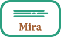
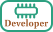

..  FogDrive (https://github.com/FogDrive/FogDrive)
    Copyright (C) 2016  Daniel Llin Ferrero

    This program, including it’s documenation and related circuit designs
    is free software: you can redistribute it and/or modify
    it under the terms of the GNU General Public License as published by
    the Free Software Foundation, either version 3 of the License, or
    any later version.

    This program is distributed in the hope that it will be useful,
    but WITHOUT ANY WARRANTY; without even the implied warranty of
    MERCHANTABILITY or FITNESS FOR A PARTICULAR PURPOSE.  See the
    GNU General Public License for more details.

    You should have received a copy of the GNU General Public License
    along with this program.  If not, see <http://www.gnu.org/licenses/>.

.. FogDrive documentation master file, created by
   sphinx-quickstart on Thu Sep 29 23:41:44 2016.
   
   

===================
Welcome to FogDrive
===================

FogDrive is project that aims to provide free and open source electronics for controlling vaping devices.
This includes the circuit specifications, parts lists, proposals on how to build the actual board
and – last but not least – the firmware for the micro-controller which is part of the circuit.

FogDrive is a free and open project, published under the `GNU General Public License`_, version 3.

.. toctree::
    
    mira
    users
    developers

FogDrive is under early development. Currently, it provides one simple working circuit in beta status, namely :ref:`mira`.
Each of the (hopefully) multiple circuits the project will provide in the future is called “a FogDrive”.
So, Mira is the first FogDrive the FogDrive project provides. :)

     

    
Mira is the first simple FogDrive that just switches the vaporizer on and off via a MOSFET.
The vaporizer is driven directly by the battery. In addition, Mira supports a few tiny comfort
features like battery voltage supervision.

     
Well, there are two kind of stakeholders of FogDrive, the *Modder* who builds and uses a FogDrive to build an actual vape mod,
and the *Vapor*, the end user, who uses a mod with a FogDrive to vape. :) While the latter one might only be interested in some
background information (you’re welcome to browse this pages, of course!), the “User Documentation” here addresses the modder
who has to build a FogDrive.

    
     
You can also work on FogDrives sources, the circuits, the firmware or the documentation. You can do that to adapt the projects for your needs.
Since Mira for example does not have any possibility to get configured, the sources are the only way to – for example – change the four-time-click
for switching the device on and off into a triple click. Furthermore (and even better :)), you can help the project by contributing to the development.
Add some features or improve the circuits!
FogDrive could definitely need some help by some electronic geeks, micro-controller hackers
and even some modders who wants to figure out clever ways to integrate a FogDrive in self-build or reused mods.

Supporting FogDrive
===================

Future
======

As of now, we have a few rought milestones in mind:

# Creating the base for second FogDrive.

#. Creating a first circuit only passing the battery voltage unregulated, providing battery supervision and switching the device on and off
#. Providing ready-to-use builds of the project
#. Creating a second circuit providing a measurement of the vaporizers resistance
#. Realizing a voltage regulation (maybe first a step down, later on also a boost conversion)

At least the last point is kind of a long-term goal.
Of course, there will be some important in-between steps and other valuable features. But currently, there is no point for detailed planning, the next steps are clear and the vision is present. And as long as this is mostly a one-man show, the future of the project is always in danger. That brings us to the next point:

For all of those out there that are interested to participate in the development: you are very welcome! Especially people who can contribute to the design of the voltage converters and electronic geeks in general could fill a significant gap. :) If you’re intrested, please mail to `fogdrive {ät} gmx.de` or – if you can stand the German language – join the `discussion at Dampfertreff <http://www.dampfertreff.de/t151555f130-freie-und-quelloffene-Regelelektronik-Unterstuetzung-gesucht.html>`_ (even the response might be more delayed).

The very first control of the FogDrive project might probably be a simple MOSFET switch circuit, enhanced by a battery voltage measurement with a LED indicator and a multi-click on/off-switch. It might get enhanced then by a coil resistance measurement, a display and maybe some small fancy features.

    
.. 
    Indices and tables
    ==================
        
    * :ref:`genindex`
    * :ref:`modindex`
    * :ref:`search`

  
+----------------------------------------------------------------------------------------+
| FogDrive is a free and open project, you can redistribute it and/or modify             |
| it under the terms of the `GNU General Public License`_ as published by                |
| the Free Software Foundation, either version 3 of the License, or any later version.   |
|                                                                                        |
| FogDrive is distributed in the hope that it will be useful,                            |
| but without any warranty; without even the implied warranty of                         |
| merchantability or fitness for a particular purpose.  See the                          |
| GNU General Public License for more details.                                           |
+----------------------------------------------------------------------------------------+

.. _GNU General Public License: http://www.gnu.org/licenses/