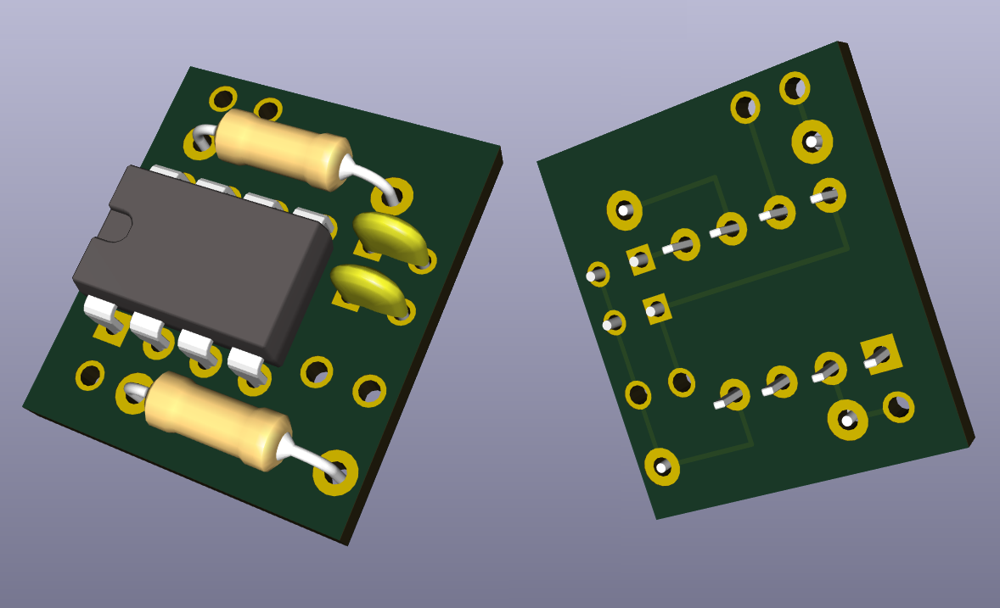
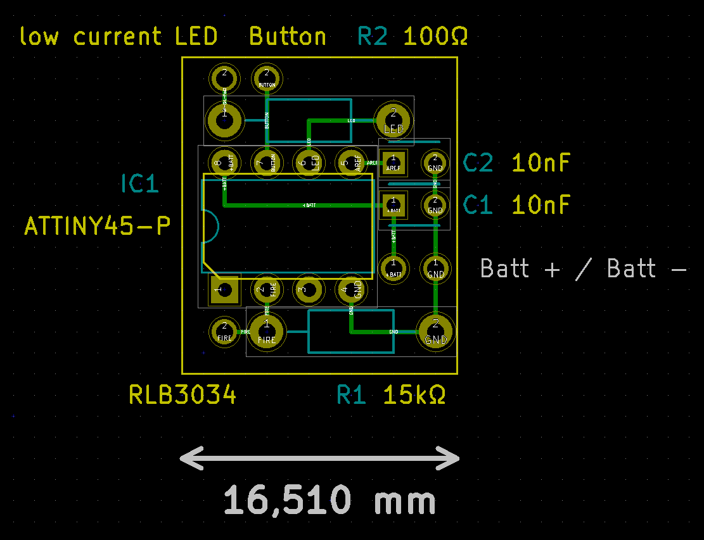
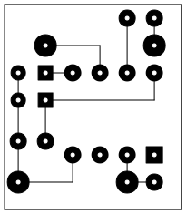

.. _mira:

====
Mira
====

Mira is the first simple FogDrive which just switches the vaporizer on and off and provides a voltage measurement.

It was mainly developed to get a grip on the topic and the basic technologies and to have a first simple
circuit that is small enough to fit into a 22mm tube, even when it’s build on a PCB with a
2.54 mm raster and “through-hole” parts (including a DIL package μC).

.. _`3D image`:

   This is a 3D image of the front and back side of the example PCB layout for Mira. The board measures 16.5mm × 19mm
   and is designed with a 2.54 mm raster for “through-hole” parts (including a DIL package μC). This makes it easy to
   solder and makes it possible to use standard breadboard and stripboard PCBs.

Mira is in beta status. Some tiny enhancements might come up soon and it is going into the practical test phase.

Features
========

These are the basic features:

* Direct switching the battery voltage to the vaporizer (n-channel MOSFET, low-side, gate powered via the μC with the battery voltage)
* Simple user interface (UI), based on one button switch and one LED
* Switching on and off the device via a four-click (LED blinks)
* Battery supervision

  * LED stays off during vaping with battery voltage ≥ 3.5 V (under load)
  * LED lights up at battery voltage between 3.2 V and 3.5 V (under load)
  * LED blinks when battery voltage drops beneath 3.2 V (under load)
  * (Inhibiting firing at very low voltage to be implemented)
  
* Battery voltage display on double click (LED “blinks” the last measured battery voltage under load)

Parts
=====

Miras circuit consists of only a handfull of parts with a total cost of less than 7€, depending where you buy it, of course.
The parts are listed in the following table:

==========  ================= ====================================== ======
Reference   Part              Value/Type                             Number
==========  ================= ====================================== ======
IC1         Micro-controller  ATTiny45 P/PU                          1
R1          Resistor          15 KΩ                                  1
R2          Resistor          100 Ω                                  1
C1, C2      Capacitor         10nF                                   2
SW1         Push Button       normally open                          1
D1          LED               any low current (≤ 20mA)               1
Q1          MOSFET            IRLB3034 (n-channel, TTL power FET)    1
==========  ================= ====================================== ======

Beside the ATTiny45 (**IC1**), also the ATMega328 P/PU is supported but it’s unlikely that
somebody really wants to use that chip since it’s much bigger and even a little more expensive.
The chip is just supported because it was used during development.

The resistor can be any standard carbon resistor. Higher tolerances of 5% are no problem.
**R1** is used as a pull down resistor for the MOSFET to avoid occasional gate voltages and
to allow the MOSFET’s gate to discharge after firing has stopped. **R2** is simply used as a
current limitier for the LED **D1**. The value can changed to adapt the brightness of the LED. The only
restriction is to limit the LED current to 20mA when the LED-resitor series is powered with a
fully loaded battery (4,2 V).

**C1** just buffers the μC’s power supply while **C2** is requested by the μC’s datasheet for the way the battery voltage is measured.
It should not be a problem to take a little higher values for both.

The switch **SW1** must be a closing switch (normally open, n.o.), a switch which contacts are only closed when actuated.
In most applications, a push button will be used. It can be a very small button, it does not have to carry any significant current.

The LED **D1** is a standard low current LED which current has to be limited by **R2** as explained above. Any color and shape
can be used, of course.

The MOSFET **Q1** is the actual switch of the circuit. It connects and disconnects the vaporizer to the battery on the 
behalf of the μC. In principle, any n-channel power MOSFET can be used as long as a high drain current and a low gate
voltage is supported.

Circuit
=======

The circuit is not problematic at all. The basic roles of the particular parts are explained in the `Parts`_ section.
The connections are also not problematic since we have no high frequencies mostly low currents in general.
High currents are flowing only through these three connections:

* From the battery plus pole to the vaporizer
* From the battery minus to the MOSFETs Source
* From the MOSFETs Drain to the vaporizer

These conncetions must have a proper diameter and should be as short as possible.

.. _`Circuit Schema`:

You should also take care that the conncetion from the MOSFETs Gate through resistor **R1** 
to GND (Battery minus) is stable. It doesn't take a high current, so you can use even a very thin
connection, but the connection should never break. Otherwise, the vaporizer could be cathed in a
“contineous firing” where it's not possible to stop the fire without disconnection either the
vaporizer or the battery.

Higher frequencies are only present on the connection of the LED **D1** since the LED is controlled 
by a PWM which controls the LEDs brightness.

Firmware
========

Both targets, the AT Tiny 45 as well as the AT Mega 328 must run with 1 MHz by the internal clock.
This is the factory setting, so there is no need at all to change any fuse bits. The firmware can just be download to the μC as
it comes from the shop. The process of “flashing” (programming) the μC is explained at “:ref:`users_programming`” on the “Users” page.

Some background information for those who are intrested:
Mira’s firmware is the result of the some first experiments of programming a μC as well as the result of some incremental enhanced design approaches.
It was designed and refactored with the goal to have some fundamentals for the next circuit.
All in all, the firmware’s flash footprint is bigger than necessary, but small enough to fit on the planned minimum target,
the AT Tiny 45. Mira’s firmware needs ~4kByte (currently 4052 bytes) for the AT Tiny 45 P, and ~6kByte (currently 6202 bytes) for the AT Mega 328 P.
The AT Mega firmware is bigger because of some debug and development feature available for the UART connection which runs with 4800 baud.

Example PCB Arrangement
=======================

In most setups, the switch, the LED and the MOSFET (SW1, D1, Q1) will be mounted ouside of the PCB, directly connected the the mods housing.
The remaining parts are soldered on a PCB.

   
   A concept view of the Mira example PCB. Top view.

The example PCB for Mira given here follows this approach. The PCB has a size of 16.5mm × 19mm.
It uses only standard “through-hole” parts and a standard 2.54 mm raster. This makes it possible to use “solder breadboards”
or stripboards. Everybody with a little bit of soldering experience and craftsmans skills should be able to build a Mira FogDrive.
The `3D image`_ on the top of this page gives an impression on how the parts are mounted on the front side and on how the
tracks are places on the back side. Also the `Circuit Schema`_ shown in the previous section should be checked when a Mira
FogDrive is build. For additional information, a CAD image (top view) and a track plot (bottom view) is shown in this section.

   
   The tracks of the Mira example PCB. Botton view.
   A `PDF version`_ as DIN A4 page can be used for
   a real scale print.

The track plot is also available as `PDF version`_. It is plotted on a DIN A4 sheet and should produce a scale correct printout
when printed with 100% scale and without borders. It can also be used to produce a real printed circuit board.
   
.. _`PDF Version`: _static/mira_board_slim_tracks.pdf

By changing some cable connections and maybe placing one or both resistors also outside of the PCB, it is possible to further shrink the size of the PCB.
Of course, with SMD parts even much smaller sizes can be archived. It is also possible to build the whole circuit in a  “flying”
construction, without any PCB but having the parts directly soldered together. This is absolutely possible with a small circuit like Mira.

